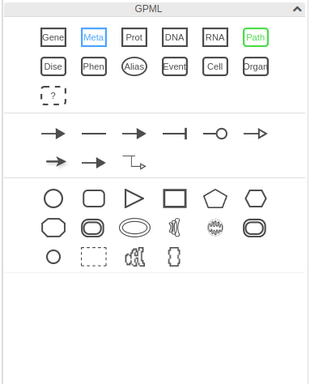
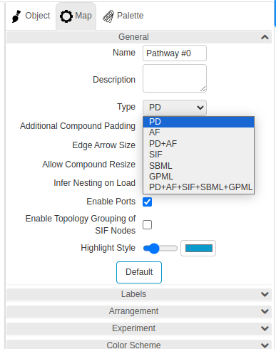

This week, we embarked on an exciting journey to enhance our project's visual representation capabilities by integrating the Newt GPML Palette. Our goal was to support a variety of node and edge types, specifically focusing on DataNodes, Interactions, and Shapes. This integration is pivotal for our project as it allows for a more comprehensive and detailed visualization of biological pathways.

DataNodes, Interactions, and Shapes
The integration process involved adding new svg images for each node and edge type to our Palette. This was a meticulous process, as we aimed to ensure that each svg image was in line with our current UI conventions. To maintain a cohesive and organized look, we decided to introduce these new elements under the title "GPML"

### Issue

### GPML elements in Palette

[Issue #718](https://github.com/iVis-at-Bilkent/newt/issues/718)

### Commits

- (https://github.com/iVis-at-Bilkent/newt/commit/ff8a05485ca7c132041712068c6f8c08f8efaae0)
- (https://github.com/iVis-at-Bilkent/newt/commit/cd63f6b3b7dbda84ad9fb938d4f24e17a833b422)
- (https://github.com/iVis-at-Bilkent/newt/commit/fbfe5845393345e8d307b37611b02ebd10d6c2f4)
- (https://github.com/iVis-at-Bilkent/newt/commit/78323fcfbe28b21ee4f0a3afbbcbd8e4593c6604)
- (https://github.com/iVis-at-Bilkent/newt/commit/be960d1f0a52175dc950ef11a6d19484145d41d5)
- (https://github.com/iVis-at-Bilkent/newt/commit/7b1421c7adc4e64ab80f673ec4facfd2a5914443)
